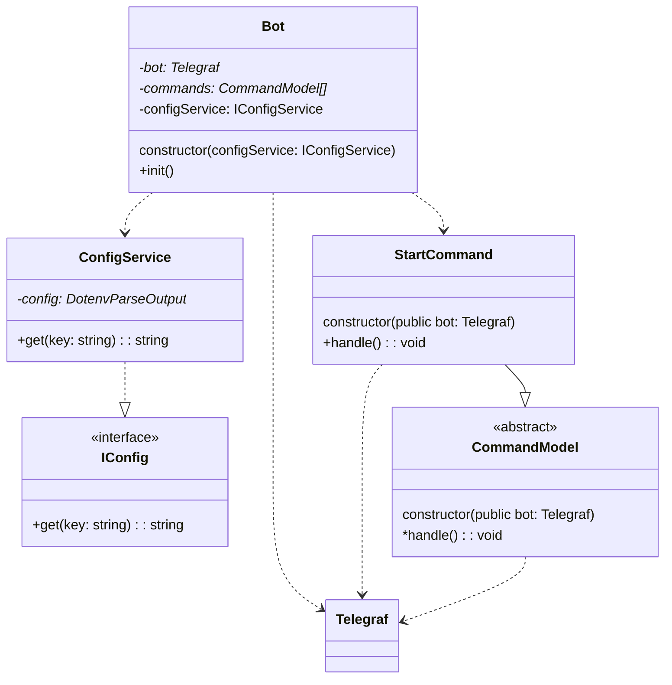
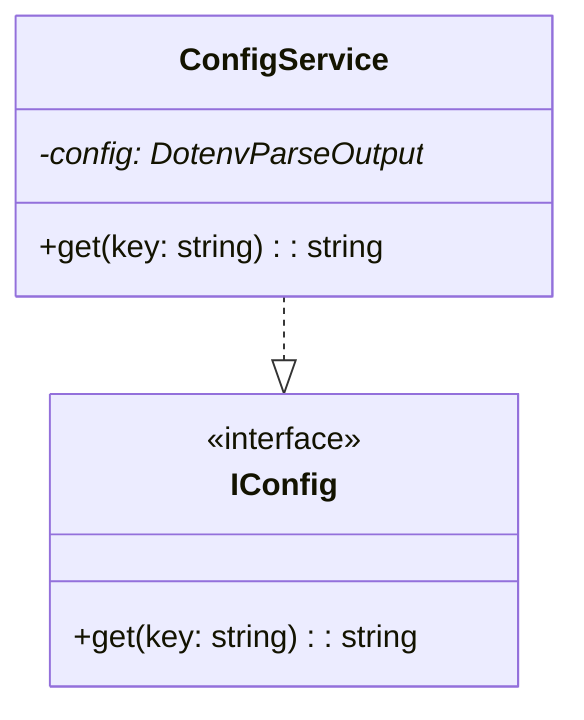
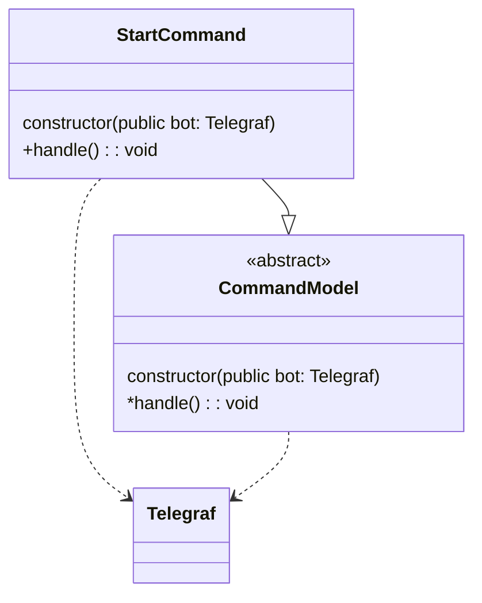

# Telegram bot, built with some architecture.

## About
Made with [this](https://www.youtube.com/watch?v=ssaG31RBao0) tutorial

This is the pet project thai I will be using to learn Telegram API and [Telegraf.js](https://github.com/telegraf/telegraf)

<!--toc:start-->
- [Telegram bot, built with some architecture.](#telegram-bot-built-with-some-architecture)
  - [About](#about)
- [Docs](#docs)
  - [Diagrams](#diagrams)
    - [Full with main file](#full-with-main-file)
    - [Services](#services)
    - [Models](#models)
<!--toc:end-->

# Docs

## Diagrams

### Full with main file

### Services

### Models

